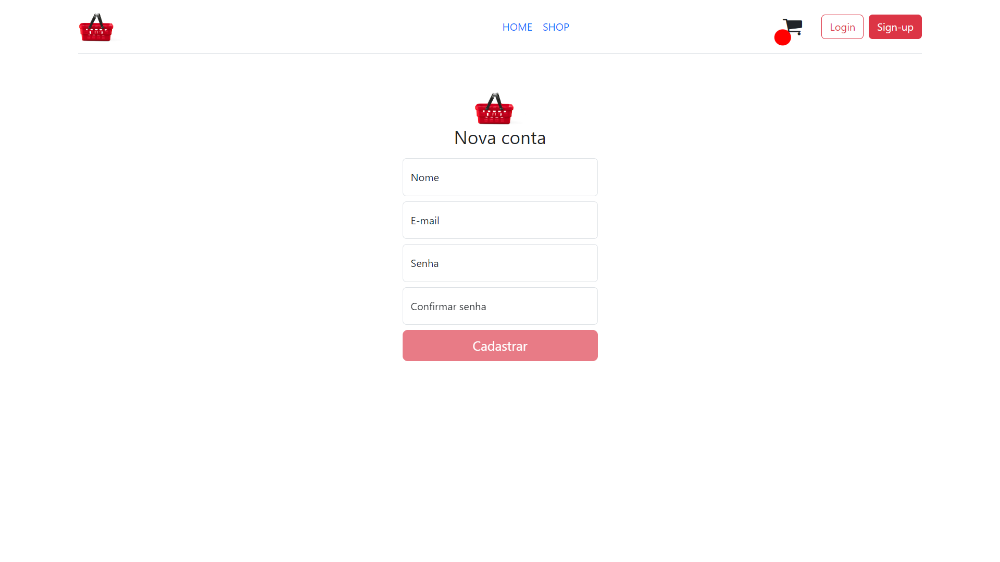
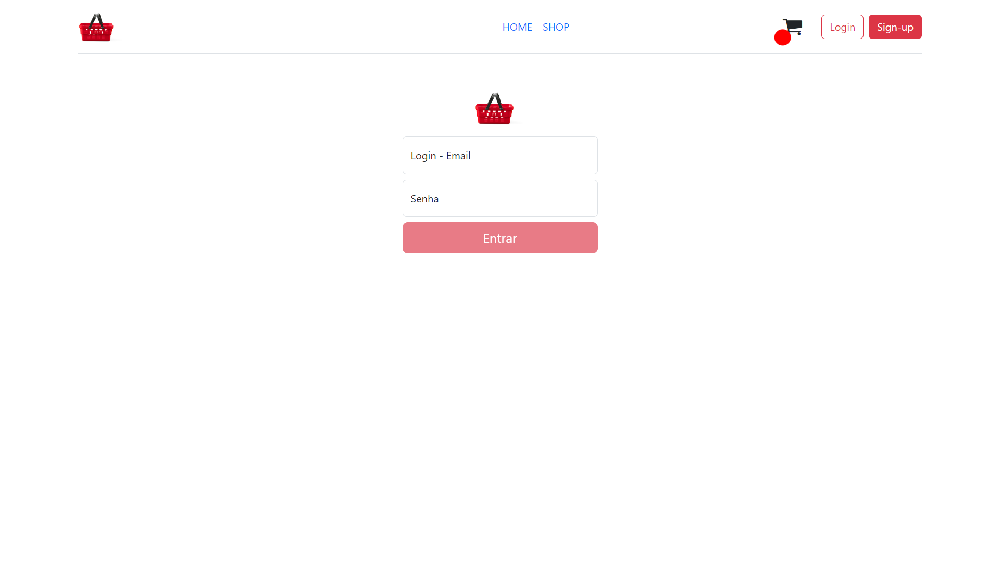
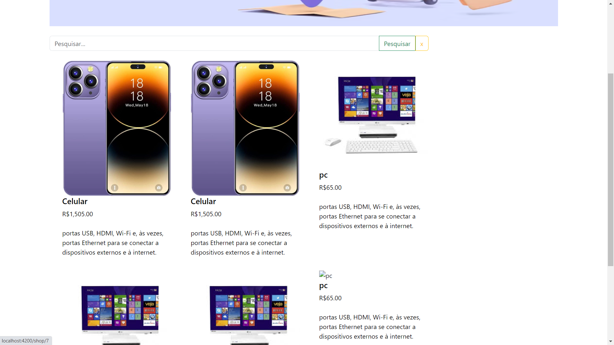
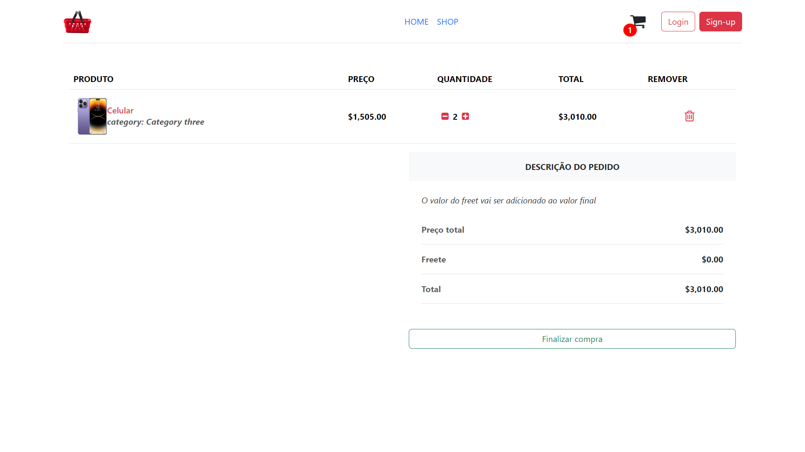
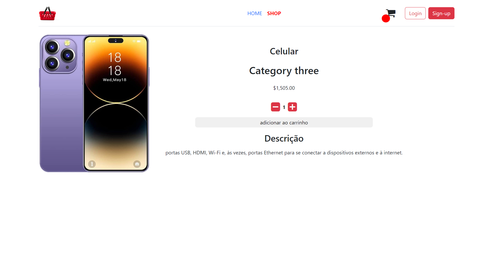
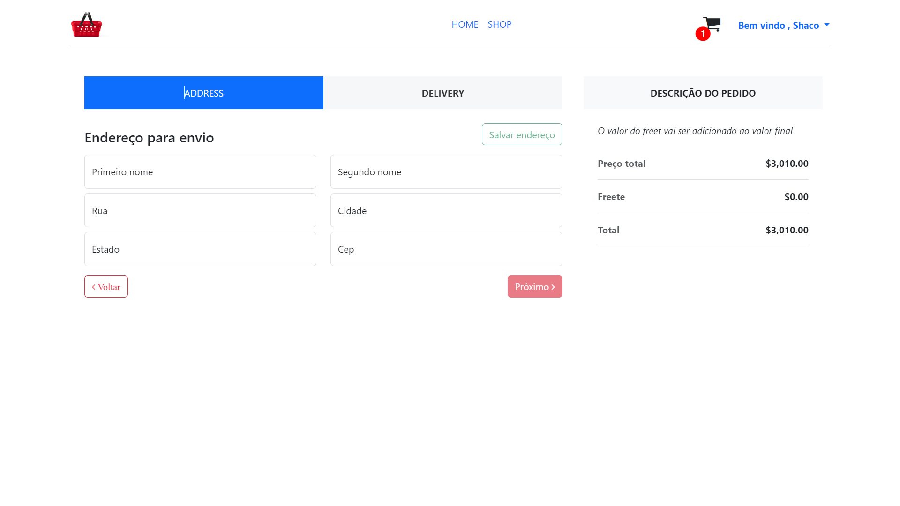
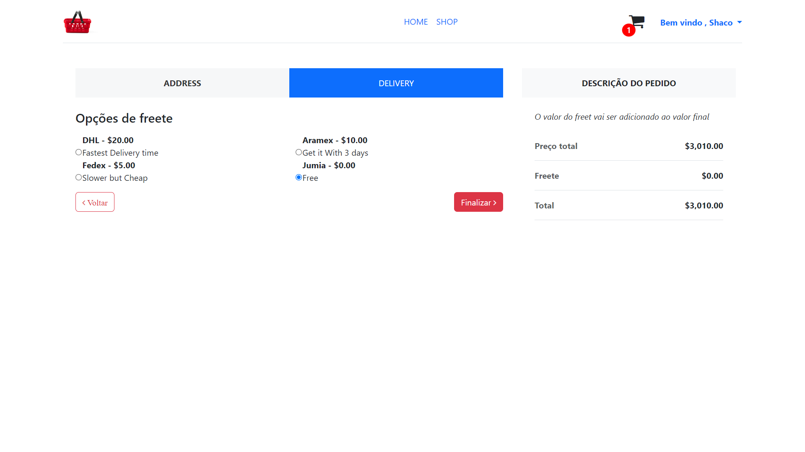

# E-commerc

Para acessar o repositório do Backend, <a href="https://github.com/RichardLimaDxD/api_ecommerc" target="_blank">clique aqui</a>.

## Seções do projeto

- [Descrição](#✔️-descrição)
- [Funcionalidades](#💻-funcionalidades)
- [Tecnologias](#🔨-tecnologias)
- [Instalação e Execução](#🚀-instalação-e-execução)

## ✔️ Descrição

Site de e-commerc com angular.js;

## 💻 Funcionalidades

- Cadastro de usuário;

- Login;

- Página inicial;

- Carrinho de compra

- Página de visualização de produto por id;

- Página de finalização de pedido;

## 🔨 Tecnologias

- `npm`
- `bootstrap`
- `angular`
- `Typescript`
- `Git`
- `Github`
- `font-awesome`
- `uuid`
- `Sass`

## 🚀 Instalação e Execução

É necessário ter instalado em sua máquina o `Node.Js` e o gerenciador de pacotes `npm` e angular, caso ainda não tenha angular em sua máquina, use esse comando `npm install -g @angular/cli`,
Para executar a aplicação localmente, siga estas etapas:

1.  Clone este repositório;
2.  Abra o repositório no `vscode` e abra um terminal para as instalação das dependências;
3.  Rode os seguintes comandos no terminal:

         npm install
         ng serve

4.  Abra seu navegador e acesse o servidor pelo seguinte link:

        http://localhost:4200/
